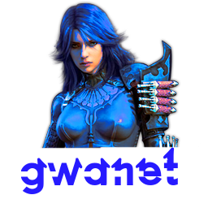

 

    
 

# 
 GWANet 

.NET API interface for Guild Wars game client.

Credits to all GWCA contributors for reversal information.

## Usage
Include the following project into your solution, then simply call Initialize()
You can browse GWANet.Main.SystemTests project to get a hang of it.
